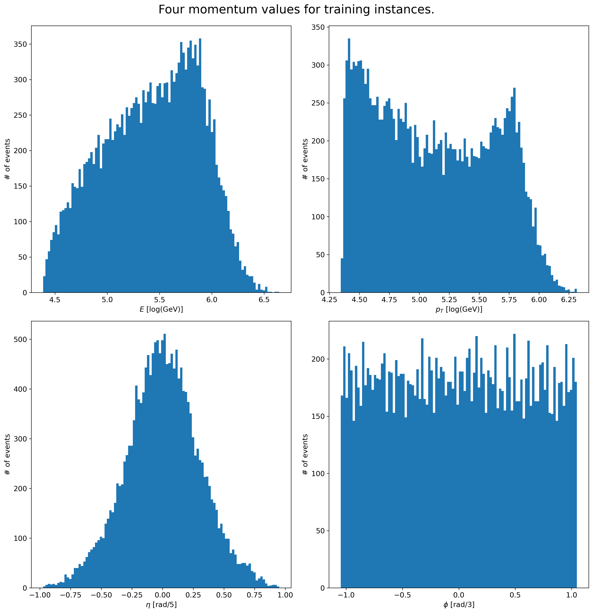
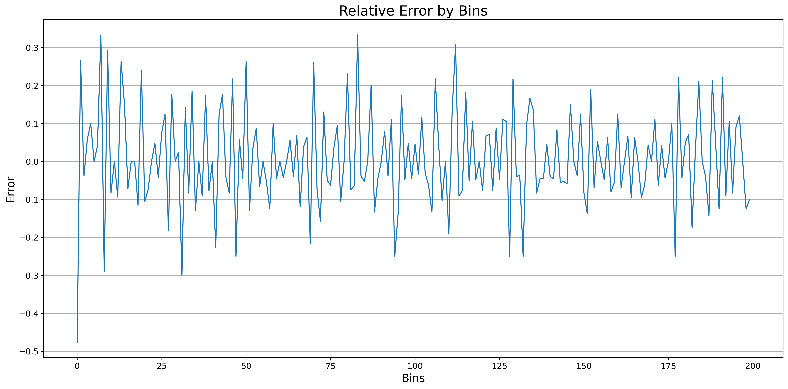

# ATLAS-Autoencoders

In this, we'll train an Autoencoder to compress the four momentum of jet particles into 3, based on ATLAS data.

## Getting Started

1. Clone this repo and then open the ATLAS_Autoencoders.ipynb notebook OR directly open in Colab [from here](https://colab.research.google.com/drive/1lbKVg9AUMowreMPxFsdBwJuLK35xIOSy?usp=sharing) (Recommended)

2. If running it locally, then make sure fast.ai API is installed.

`!pip install -U fastbook
import fastbook
fastbook.setup_book()`

If running in colab, just follow the rest of instructions given in the notebook.

## Dataset

The dataset `monojet_Zp2000.0_DM_50.0_chan3.csv` is a csv file seperated by `;` and the format of dataset is shown below:

`event ID; process ID; event weight; MET; METphi; obj1, E1, pt1, eta1, phi1; obj2,
E2, pt2, eta2, phi2; . . .
`

For the objects, we have different types of objects as shown below from which we have to pick only `j` particles.

| Symbol ID | Object |
| --- | ----------- |
| j | jet |
| b | b-jet |
| e- | electron (e−) |
| e+ | positron (e+) |
| m- | muon (µ−) |
| m+ | antimuon (µ+) |
| g | photon (γ) |

## Preprocessing

First, we observe that the dataset is seperated with `;`, the dataset is read into a pandas DataFrame by splitting with `;`. 
Then, after reading the dataset, we'll remove all NaN and Null values.
Once that is done, we will perform the normalization to the data shown below
1. Since E follows the exp distribution, we perform normalization by taking logarithm (base 10) of the column. 
2. Similarly, pT also follows the exp distribution, so we perform normalization by taking logarithm (base 10) of the column. 
3. For η, we simply divide the column by 5.
4. For ɸ, we simply divide the column by 3.

For un-normalization, we will simple reverse these steps (i.e. taking exponent with power 10, mulitply by 5 and 3).


## Architecture

The Architecture which was used for training is simple feed forward neural network with fully connected layers whose size for encoding goes from 4 to 200 to 20 to 3 and for decoding it goes all the way back to 4.

A representation of the architecture is shown below.

```python
class AE_3D_200_Tanh(nn.Module):
    def __init__(self, n_features=4):
        super(AE_3D_200_Tanh, self).__init__()
        self.en1 = nn.Linear(n_features, 200)
        self.en2 = nn.Linear(200, 200)
        self.en3 = nn.Linear(200, 20)
        self.en4 = nn.Linear(20, 3)
        self.de1 = nn.Linear(3, 20)
        self.de2 = nn.Linear(20, 200)
        self.de3 = nn.Linear(200, 200)
        self.de4 = nn.Linear(200, n_features)
        self.tanh = nn.Tanh()
        
    def encode():
        ....
        
    def decode():
    	....

    def forward():
    	....
    ....
```

## Results

Overall training for 100 epochs took around 100-120 seconds. The best model reported a Training MSE of `8.771e-06` and a Validation MSE of `8.353e-06`. 

### Plots





As we can see in plots, we were able to retain most of the features after reducing dimensions with Autoencoders.

## License

[Apache License 2.0](LICENSE)
